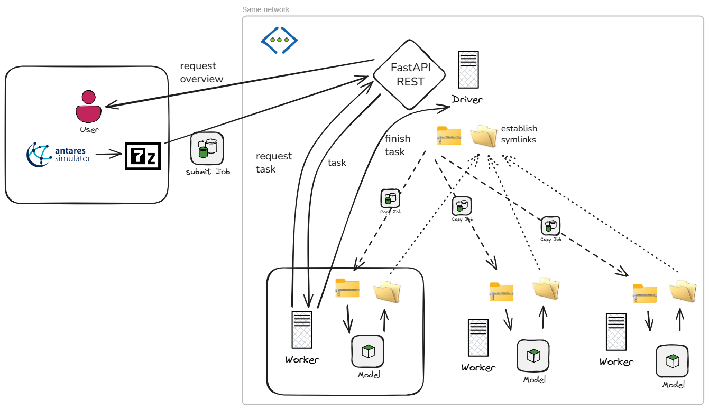

# Antares Winjobs
Antares winjobs is a windows based distributed job scheduling system. 
It allows you to schedule and manage antares simulation jobs across multiple Windows machines in a network.

<!-- TOC -->
- [Antares Winjobs](#antares-winjobs)
  - [How it works](#how-it-works)
  - [Supported antares versions](#supported-antares-versions)
  - [How to set up your local copy](#how-to-set-up-your-local-copy)
  - [How to use](#how-to-use)
    - [Run a driver](#run-a-driver)
    - [Run a worker](#run-a-worker)
    - [Run a user](#run-a-user)
  - [Additional scripts](#additional-scripts)
  - [Future work](#future-work)
  - [Author](#author)
<!-- TOC -->

## How it works
The system contains 3 actors:
- **user:** submits jobs to the driver.
- **driver:** manages job prioritization, task distribution, collects output symlinks, provides overview endpoints.
- **worker:** executes tasks ad infinitum.

This system relies heavily on windows symbolic links. Read more about them [here](docs/junctions.md).  
A sequence diagram of a standard interaction can be found [here](docs/sequence_diagram.md).  
Another component drawing is depicted below.  

[](docs/antares_winflow.png)


## Supported antares versions
- Antares 8.8: Supported.
- Antares 9.1: Saving pre-generated time series in input folder seems to be broken. Not supported.

## How to set up your local copy
It does not matter if you want to run a user, driver or worker. They are all part of this repo. As such the setup is the same.

- Clone the repo
- The repo is built with uv. Sync using `uv sync` command.
- Make sure the driver & workers have the same symlinks setup. Use the scripts in the `scripts` folder to help you with that.
- Configure the `config_().yaml` files in the `config` folder. Follow the instructions in the comments.

## How to use
All commands must be run from the root of the repo. This ensures the working directory is correct. 
### Run a driver
The driver is built on FastAPI.   
Use OpenAPI docs (/docs) to explore the API such as getting jobs overview, task details, ...  
Must be run as admin because it creates symlinks.  

```commandline
uvicorn src.main_driver:app --reload
```
or more modernly use the FastAPI CLI:
during development, with hot-reload and bound to localhost:
```commandline
fastapi dev src\main_driver.py
```
or to run without hot-reload and bound to all interfaces:
```commandline
fastapi run src\main_driver.py
```
or run using python entrypoint:
```commandline
python src\main_driver.py
```

### Run a worker
You can run as many workers as you like. But only run one per system! You can of course increase the number of threads per worker.
```commandline
python src\main_worker.py
```

### Run a user
The user is a command line tool to submit jobs and check their status.
```commandline
(antares_winjobs) C:\dev\python\antares_winjobs>python src\main_user.py -h
usage: main_user.py [-h] [--study_path STUDY_PATH] [--priority PRIORITY]

Submit an Antares study to the driver.

options:
  -h, --help            show this help message and exit
  --study_path STUDY_PATH
                        Absolute path to the Antares study folder.
  --priority PRIORITY   Job priority (default: 50)
 ```

## Additional scripts
The `scripts` folder contains additional scripts to help you manage the system.
- `setup_symlinks_local.py`: Creates symlinks/junctions for each local fixed disk drive and shares them over the network.  
  **Requires:** Run from an administrator command prompt.
- `setup_symlinks_remote.py`: Creates symlinks to network shares on remote machines, after the local setup is complete.  
  **Requires:** Run from an administrator command prompt.
- `clean_data_root.py`: Cleans up old job folders in the data root folder of the driver & worker. 
- `clean_logs_folder.py`: Cleans up old log files in the logs folder of this repo.


## Future work
This project was just an experiment to see if I could get Antares to run in a distributed manner on Windows machines.
Below are a list of improvements that go beyond the scope of this PoC.
- Add support for multiple Antares versions
- Parse configuration files using pydantic for quality control
- Add more robustness checks
- Add more unit tests
- Add overview dashboard for the user

## Author
Jorrit Vander Mynsbrugge