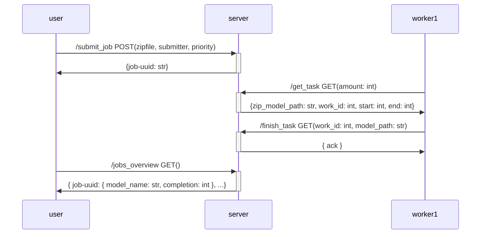

```mermaid
sequenceDiagram
    user->>+server: /submit_job POST(zipfile, submitter, priority)
    server->>-user: {job-uuid: str}

    worker1->>+server: /get_task GET(amount: int)
    server->>-worker1: {zip_model_path: str, work_id: int, start: int, end: int}
  
    % worker2->>+server: /get_task GET(amount: int)
    % server->>-worker2: {zip_model_path: str, work_id: int, start: int, end: int}

    worker1->>+server: /finish_task GET(work_id: int, model_path: str)
    server->>-worker1: { ack }

    user->>+server: /jobs_overview GET()
    server->>-user: { job-uuid: { model_name: str, completion: int }, ...}
```