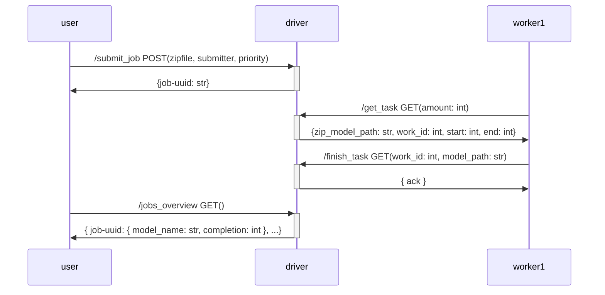

# Sequence Diagram
Endpoints are ok, payloads are a bit out of date...

```mermaid
sequenceDiagram
    user->>+driver: /submit_job POST(zipfile, submitter, priority)
    driver->>-user: {job-uuid: str}

    worker1->>+driver: /get_task GET(amount: int)
    driver->>-worker1: {zip_model_path: str, work_id: int, start: int, end: int}
  
    % worker2->>+driver: /get_task GET(amount: int)
    % driver->>-worker2: {zip_model_path: str, work_id: int, start: int, end: int}

    worker1->>+driver: /finish_task GET(work_id: int, model_path: str)
    driver->>-worker1: { ack }

    user->>+driver: /jobs_overview GET()
    driver->>-user: { job-uuid: { model_name: str, completion: int }, ...}
```